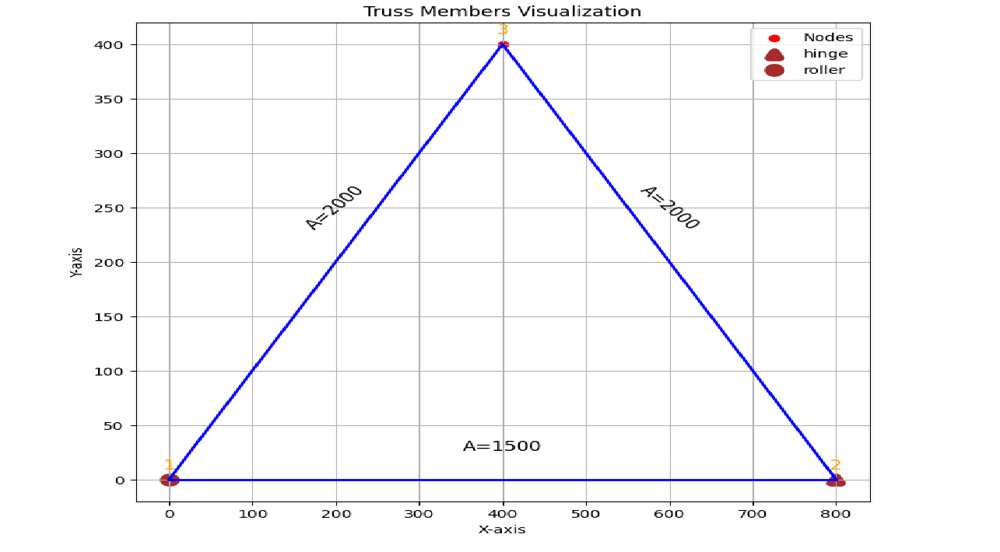

# FEA of simple truss from scratch and cross verification with the results obtained from OpenSeesPy.

## Overview

The project was an assignment provided by Prof. Thaman Bahadur Khadka during final year classes of "Computational Techniques". Being curious about implementing coding skills, that I recently was learning at that time,
I prepared this project independently. I used **Numpy**, **Sympy**, and **Matplotlib** in this particular project. Later, I integrated **OpenSeespy** into the project to cross verify the results.

## Purpose
The purpose of the project was to harness my skills of critical thinking, programming and computational techniques.

## Methodology

First of all, an example provided in the coursebook was selected to perform FEA in python. Then, the units of area, force, length, mass were defined in the jupyter notebook along with importing necessary libraries such as Numpy, Scipy and Matplotlib.
Visualtion of the model presented was done using Matplotlib to show the model has been correctly defined. Then a function named **Kstiff** was defined as to calculate the stiffness matrix of different members of truss.

### Visualization of the Model.

For solving of matrix without much of manual iterations, **Sympy** was used.
The results of FEA were {F1: -1.81684756160228e-14, F2: 75.0000000000002, F4: 75.0000000000002, u3: 0.000200000000000000, u5: 0.000100000000000000, u6: -0.000312132034355965}, which were later verified by Openseespy.

